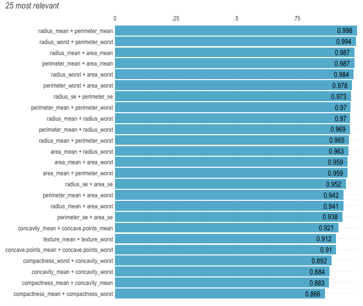
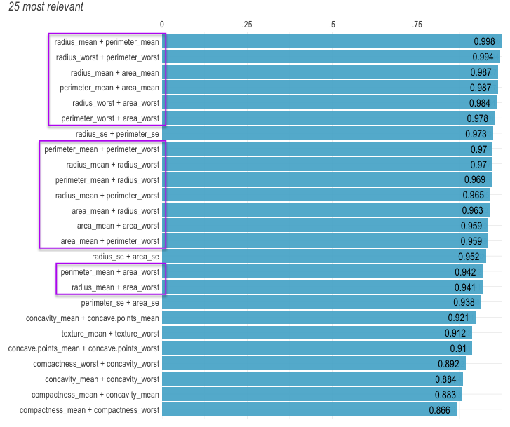
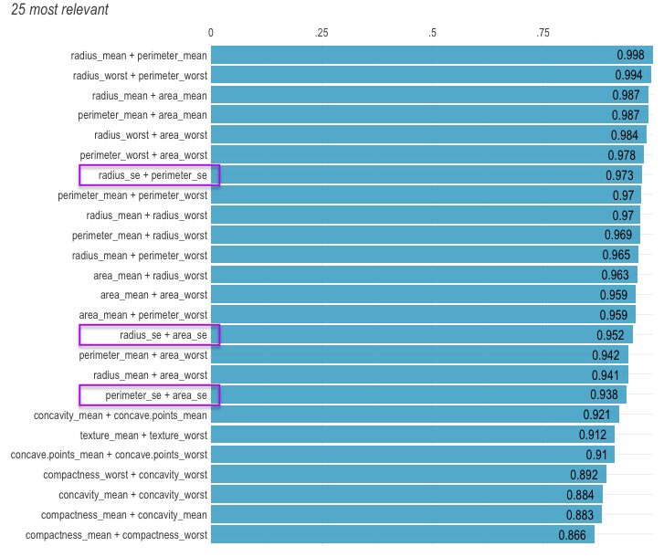
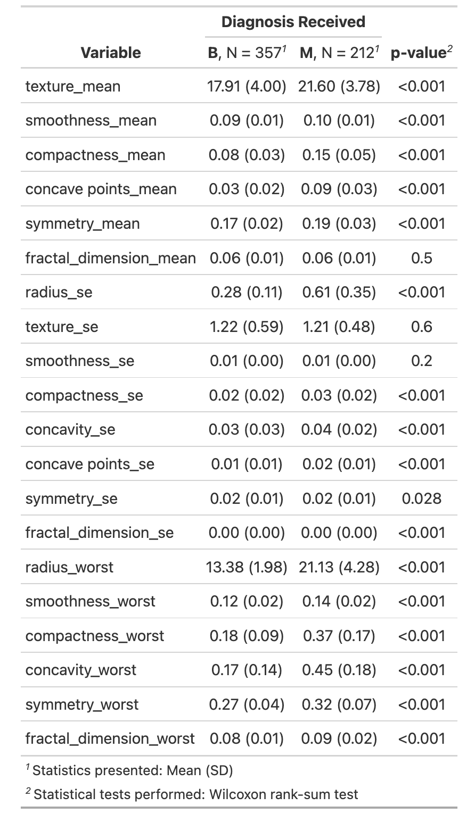
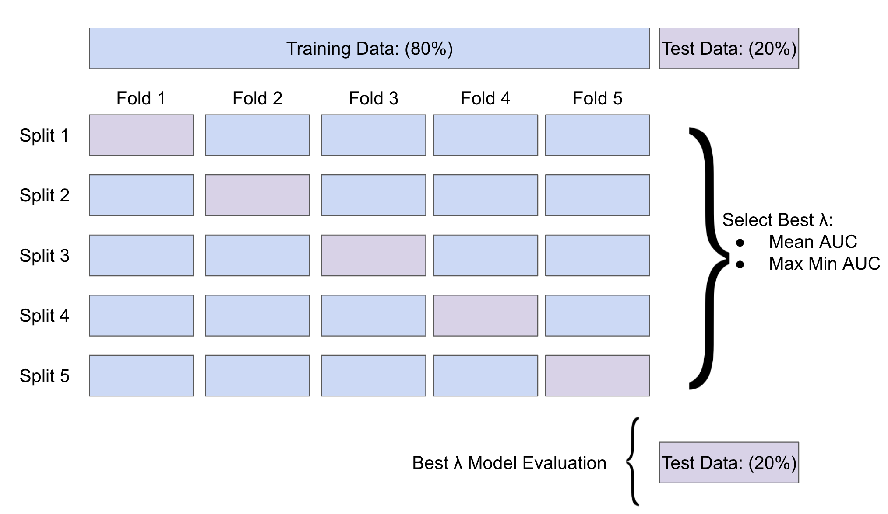

```{r setup, include=FALSE}
knitr::opts_chunk$set(echo = TRUE)
```

## Motivation
Diagnosing breast cancer is extremely important. 

According to NIH there has been an estimated: 

- 281,550 new cases of breast cancer in women in 2021, 
- 43,600 breast cancer in women related deaths in 2021.

American Cancer Society Guideline for Breast Cancer Screening:

- Women between ages 25-40 should have an annual clinical breast examination.
- Women between ages 40-44 should begin annual screening via mammogram
- Women between ages 45-54 should screened annually via mammogram

<!-- Using the mammography or Ultrasonography images radiologist -->

## Goal 

With using all the collected imagine data we want to develop an algorithm to predict diagnosis. 
Since diagnosis is a binary outcome a logistic regression will be utilized. 

Methods: 

- Newton-Raphson Algorithm (Full Model)
- Logistic LASSO Algorithm (Optimal Model)


## Data 

- 569 rows and 31 columns all related to breast tissue images
- Outcome of interest: Diagnosis (B or M) 
  - 357 benign (B) cases and 212 malignant (M) cases
- The Covariates include information such as radius, texture, perimeter, area, smoothness, compactness, concavity, concave points, symmetry, and fractal dimension.


## Figure 1: Ranked Cross-Correlations

{width=80%}

## Figure 1: Ranked Cross-Correlations

{width=80%}

Best Representative `radius_worst` 

## Figure 1: Ranked Cross-Correlations

{width=80%}

Best Representative `radius_se` 


## Table 1: Remaining Variables

{width=45%}

<!--Talk about test and train split -->


## Full Model (Newton-Raphson)

To impliment the Newton-Raphson Method we need the likelihood, gradiant, and hessian matrix. Let
\[
\pi_i = P(Y_i=1|x_{i,1}, \dots x_{i,p})  = \frac{e^{\beta_0+\sum^{p}_{j=1}\beta_jx_{i,j}}}{1 + e^{\beta_0+\sum^{p}_{j=1}\beta_jx_{i,j}}}.
\]
<!--likelihood function:
\[ L(\mathbf{X}| \mathbf{\beta}) = \prod^n_{i=1} \left[ \pi_i^{y_i}(1-\pi_i)^{1-y_i} \right]
\] -->
**The log-likelihood:**
\[ l(\mathbf{X}| \vec{\beta}) =\sum^n_{i=1} \left[ y_i\left(\beta_0 + \sum^{p}_{j=1}\beta_jx_{i,j}  \right) - \log\left( 1 + \exp\left(\beta_0 + \sum^{p}_{j=1} \beta_jx_{i,j} \right) \right) \right]
\]
<!--
\[ l(\mathbf{X}| \vec{\beta}) =\sum^n_{i=1} \left[ y_i\left(\beta_0 + \sum^{20}_{j=1}\beta_jx_{i,j}  \right) + \log( 1 - pi_i)  \right) \right]
\]-->
**The gradient:**
\[ \nabla l(\mathbf{X}|\vec{\beta}) = \left[  \begin{matrix} \sum^n y_i-\pi_i & \sum^n x_{i,1}(y_i-\pi_i) & \dots & \sum^n x_{i,p} (y_i-\pi_i) \end{matrix}\right]^{T}_{1 \times (p+1)} 
\]
**The hessian:** produces a matrix $(p+1 \times p+1)$
\[ 
\nabla^2 l(\mathbf{X}|\vec{\beta}) = - \sum^n_{i=1} \begin{pmatrix} 1 \\ X \end{pmatrix} \begin{pmatrix} 1 & X \end{pmatrix} \pi_i (1-\pi_i)
\]

<!--
\begin{align*}
 \nabla^2 l(\mathbf{X}|\vec{\beta}) &= - \sum^n_{i=1} \begin{pmatrix} 1 \\ X \end{pmatrix} \begin{pmatrix} 1 & X \end{pmatrix} \pi_i (1-\pi_i) \\
 &= - \begin{pmatrix} 1 & X \end{pmatrix} diag( \pi_i (1-\pi_i)) \begin{pmatrix} 1 \\ X \end{pmatrix}
\end{align*}
-->


## Optimal Model (Logistic LASSO)

also going to be some math 


## Optimal Model (Logistic LASSO)

more math 

## Figure 2: 5-fold Cross Validation 
{width=105%}

## Cross Validation Results 

Best $\lambda$ using AUC

## LASSO Coefficients

Best $\lambda$ using beta plot


## Coefficients Comparison 


## AUC 


## Discussion 


## Resources 

Cancer Stat Facts: Female Breast Cancer.  \textit{National Cancer Institute - NIH}   https://seer.cancer.gov/statfacts/html/breast.html 

American Cancer Society. (2019). Breast cancer facts & figures 2019–2020. Am Cancer Soc, 1-44.

