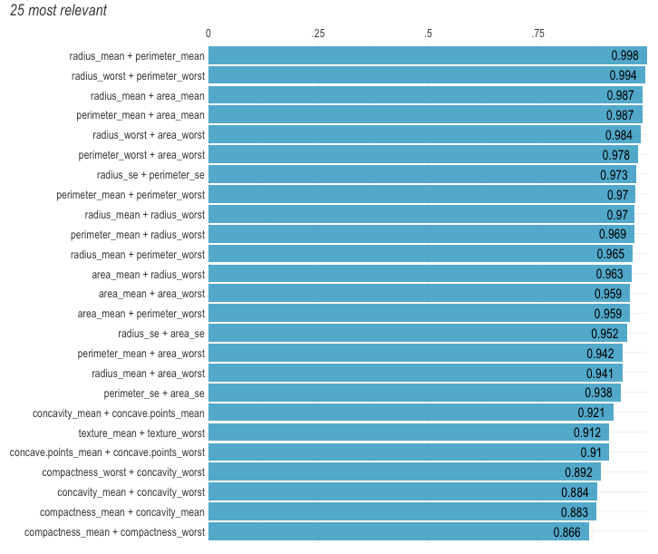
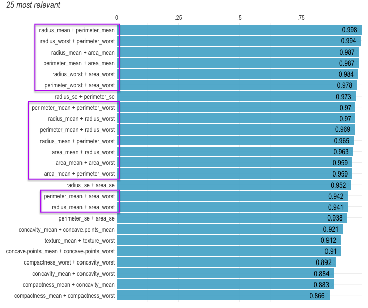
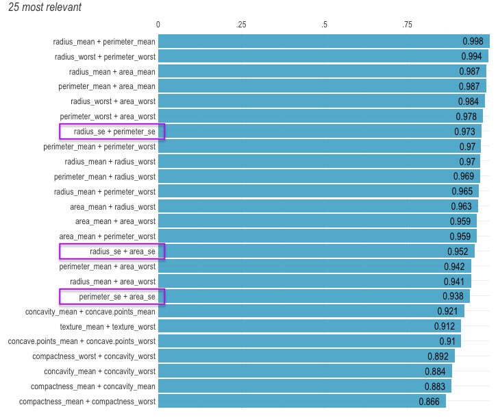
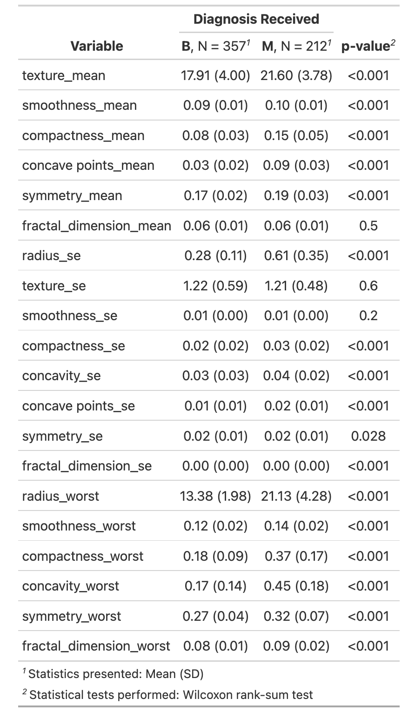
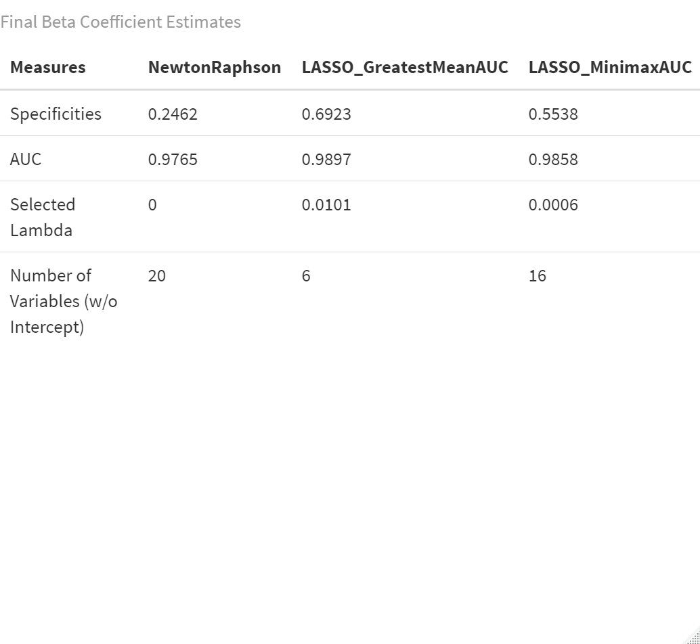

```{r setup, include=FALSE}
source("shared_code/setup.R")
load("plotting_data.RData")


knitr::opts_chunk$set(echo = TRUE)
library(tidyverse)
library(lares) # for the correlation plot 
library(gtsummary)

## loading in the full dataset. 
bc <- read.csv("data/breast-cancer.csv") %>% as_tibble()
```

## Motivation
Diagnosing breast cancer is extremely important. 

According to NIH there has been an estimated: 

- 281,550 new cases of breast cancer in women in 2021, 
- 43,600 breast cancer in women related deaths in 2021.

American Cancer Society Guideline for Breast Cancer Screening:

- Women between ages 25-40 should have an annual clinical breast examination.
- Women between ages 40-44 should begin annual screening via mammogram
- Women between ages 45-54 should screened annually via mammogram

<!-- Using the mammography or Ultrasonography images radiologist -->

## Goal 

With using all the collected imagine data we want to develop an algorithm to predict diagnosis. 
Since diagnosis is a binary outcome a logistic regression will be utilized. 

Methods: 

- Newton-Raphson Algorithm (Full Model)
- Logistic LASSO Algorithm (Optimal Model)


## Data 

- 569 rows and 31 columns all related to breast tissue images
- Outcome of interest: Diagnosis (B or M) 
  - 357 benign (B) cases and 212 malignant (M) cases
- The Covariates include information such as radius, texture, perimeter, area, smoothness, compactness, concavity, concave points, symmetry, and fractal dimension.

## Figure 1: Correlation Heat Plot of all Covariates
```{r echo=FALSE, message=FALSE, warning=FALSE, fig.width = 8, fig.asp=0.8}
bc_corr <- bc %>% 
  mutate(y = ifelse(diagnosis == "M", 1, 0)) %>% 
  relocate(y)  %>% 
  select(-c(id, y, diagnosis))

cor_cov_all <- cor(bc_corr)

bad <- c(
  "area_mean", "area_worst", "perimeter_mean", "perimeter_worst", "radius_mean"
  , "perimeter_se", "area_se"
  , "concave points_worst", "concavity_mean"
  , "texture_worst"
)

#title = "Figure 1: Correlation Heat Plot of all Covariates"
corrplot::corrplot(cor_cov_all, 
                   method = "color",
                   type = "lower", 
                   insig = "blank",
                   diag = FALSE,
                  # title=title,
                   mar=c(0,0,10,0)) 
```

## Figure 1: Ranked Cross-Correlations

{width=80%}

## Figure 1: Ranked Cross-Correlations

{width=80%}

Best Representative `radius_worst` 

## Figure 1: Ranked Cross-Correlations

{width=80%}

Best Representative `radius_se` 


## Table 1: Remaining Variables

{width=45%}

<!--Talk about test and train split -->


## Full Model (Newton-Raphson)

Consider the following log-likelihood, gradient, and hessian matrix. 
First, let
\[
\pi_i = P(Y_i=1|x_{i,1}, \dots x_{i,p})  = \frac{e^{\beta_0+\sum^{p}_{j=1}\beta_jx_{i,j}}}{1 + e^{\beta_0+\sum^{p}_{j=1}\beta_jx_{i,j}}}.
\]
**The log-likelihood:**
\[ l(\mathbf{X}| \vec{\beta}) =\sum^n_{i=1} \left[ y_i\left(\beta_0 + \sum^{p}_{j=1}\beta_jx_{i,j}  \right) - \log\left( 1 + \exp\left(\beta_0 + \sum^{p}_{j=1} \beta_jx_{i,j} \right) \right) \right]
\]
**The gradient:**
\[ \nabla l(\mathbf{X}|\vec{\beta}) = \left[  \begin{matrix} \sum^n y_i-\pi_i & \sum^n x_{i,1}(y_i-\pi_i) & \dots & \sum^n x_{i,p} (y_i-\pi_i) \end{matrix}\right]^{T}_{1 \times (p+1)} 
\]
**The hessian:** produces a matrix $(p+1 \times p+1)$
\[ 
\nabla^2 l(\mathbf{X}|\vec{\beta}) = - \sum^n_{i=1} \begin{pmatrix} 1 \\ X \end{pmatrix} \begin{pmatrix} 1 & X \end{pmatrix} \pi_i (1-\pi_i)
\]

<!--likelihood function:
\[ L(\mathbf{X}| \mathbf{\beta}) = \prod^n_{i=1} \left[ \pi_i^{y_i}(1-\pi_i)^{1-y_i} \right]
\] -->
<!--
\[ l(\mathbf{X}| \vec{\beta}) =\sum^n_{i=1} \left[ y_i\left(\beta_0 + \sum^{20}_{j=1}\beta_jx_{i,j}  \right) + \log( 1 - pi_i)  \right) \right]
\]-->

<!--
\begin{align*}
 \nabla^2 l(\mathbf{X}|\vec{\beta}) &= - \sum^n_{i=1} \begin{pmatrix} 1 \\ X \end{pmatrix} \begin{pmatrix} 1 & X \end{pmatrix} \pi_i (1-\pi_i) \\
 &= - \begin{pmatrix} 1 & X \end{pmatrix} diag( \pi_i (1-\pi_i)) \begin{pmatrix} 1 \\ X \end{pmatrix}
\end{align*}
-->


## Optimal Model (Logistic LASSO)


__Lemma 1.__ Consider the optimization problem
  \[ \min_{x \in \mathbb{R}}  \left\{ \frac{1}{2}(x - b)^2 + c|x| \right\} \]
for $b \in\mathbb{R}$ and $c \in \mathbb{R}_{++}$. It follows that the minimizer is given by
  \[ \hat{x} = S(b, c), \]
where $S$ is the soft-thresholding operator.

__Lemma 2.__ Consider the optimization problem
  \[ \min_{\beta_k \in \mathbb{R}} \left\{ \frac{1}{2n} \sum_{i = 1}^n w_i \left(z_i - \sum_{j = 1}^p \beta_j x_{ij} \right)^2 \right\} \]
for some $k \in \{ 1, \ldots, p \}$. It follows that the minimizer is given by
  \[ \hat{\beta}_k = \left( \sum_{i = 1}^n w_i x_{ik}^2 \right)^{-1} \sum_{i = 1}^n w_i x_{ik} \left(z_i - \sum_{j \neq k} \beta_j x_{ij} \right). \]


## Optimal Model (Logistic LASSO)

__Lemma 3.__ With $\hat{\beta}_k$ defined as above,
\begin{align*}
\min_{\beta_k \in \mathbb{R}}& \left\{ \frac{1}{2n} \sum_{i = 1}^n w_i \left(z_i - \sum_{j = 1}^p \beta_j x_{ij} \right)^2 + \lambda \sum_{j = 1}^p |\beta_j| \right\} \\
  &= \min_{\beta_k \in \mathbb{R}} \left\{ \frac{1}{2}(\beta_k - \hat{\beta}_k)^2 + \left( \frac{1}{n} \sum_{i = 1}^n w_i x_{ik}^2 \right)^{-1} \lambda |\beta_k| \right\}.
\end{align*}

<!--__Proposition.__--> By Lemma 1 and Lemma 3,
\begin{align*}
 \underset{\beta_k \in \mathbb{R}}{\arg \min} & \left\{ \frac{1}{2n} \sum_{i = 1}^n w_i \left(z_i - \sum_{j = 1}^p \beta_j x_{ij} \right)^2 + \lambda \sum_{j = 1}^p |\beta_j| \right\} \\
  &= S \left(\hat{\beta}_k, \left( \frac{1}{n} \sum_{i = 1}^n w_i x_{ik}^2 \right)^{-1} \lambda \right) 
 \end{align*} 

## Figure 2: 5-fold Cross Validation 
{width=105%}

## Cross Validation Results: Selecting Best Lambda 

```{r, warning=FALSE, message=FALSE, echo=FALSE}
auc_vs_lambda <- 
  cv_res[[1]][[1]] %>% 
  data.frame() %>% 
  ggplot(x = lambda, y = mean_auc) +
  geom_line(aes(x = lambda, y = mean_auc), col = "black") +
  geom_vline(xintercept = selected_lambda, linetype = "dashed", color = "red") +
  geom_point(aes(x = lambda, y = mean_auc), col = "black") +
  geom_text(aes(x = selected_lambda, y = 0.96, label = "Lambda - Greatest Mean AUC = 0.0101"), col = "red", size = 3, hjust = -0.05) +
#  coord_cartesian(xlim = c(0, 0.2), ylim = c(.9, 1)) +
  labs(title = "Mean AUC vs. Lambda",
       x = "Lambda",
       y = "Mean AUC")
auc_vs_lambda
```

## Cross Validation Results: LASSO Coefficients

```{r, warning=FALSE, message=FALSE, echo=FALSE}
beta_coef_plot <- 
  lfr_df %>% 
  group_by(lambda) %>% 
  filter(beta_coef != "intercept") %>% 
  ggplot(x = -log(lambda), y = coef_est, group = beta_coef) +
  geom_path(aes(x = -log(lambda), y = coef_est, group = beta_coef, col = beta_coef)) +
  geom_vline(xintercept = -log(selected_lambda), col = "black", linetype = "dashed") + 
  geom_text(aes(x = -log(selected_lambda), y = 5, label = "Lambda - Greatest Mean AUC"), colour = "black", size = 3, hjust = 1.05) +
  geom_vline(xintercept = -log(selected_lambda_minmax), col = "black", linetype = "dashed") +
  geom_text(aes(x = -log(selected_lambda_minmax), y = 5, label = "Lambda - Minimax AUC"), colour = "black", size = 3, hjust = 1.05) +
  labs(title = "Beta Coefficients in LASSO Model")
beta_coef_plot
```

## Coefficients Comparison 

{width=105%}
## ROC Plots

```{r}
plot(roc_lasso, legacy.axes = TRUE, col = "goldenrod", 
     main = "ROC Curves from Test Data Predictions")
plot(roc_minimax, col = "darkgreen", add = TRUE)
plot(roc_nr, col = "dodgerblue", add = TRUE)
legend("bottomright", legend = paste0(model_names, ": ", auc_vec), 
       col = c("goldenrod", "darkgreen", "dodgerblue"), lwd = 2, bty = "n")
```


## Discussion 

- Goal is accurately classify every patient
- Balancing Sensitivity vs. Specificity. 
  - In first screening cases want to catch every case. Maximize Sensitivity.  
  
  
  
  

## Resources 

Cancer Stat Facts: Female Breast Cancer.  \textit{National Cancer Institute - NIH}   https://seer.cancer.gov/statfacts/html/breast.html 

American Cancer Society. (2019). Breast cancer facts & figures 2019–2020. Am Cancer Soc, 1-44.

