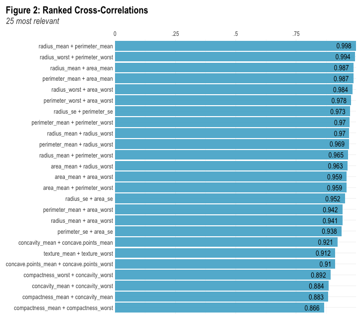
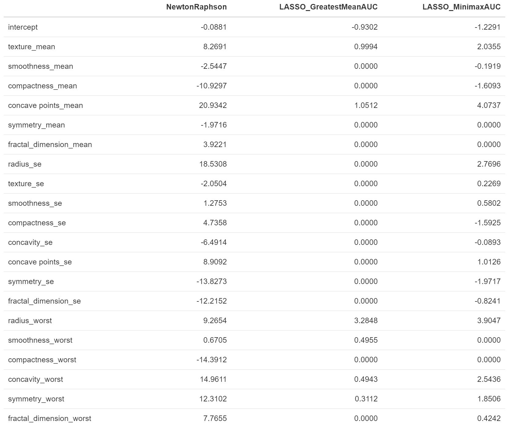
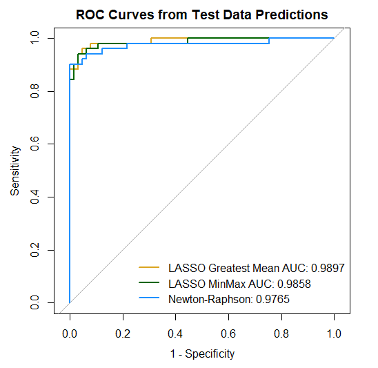

```{r setup, include=FALSE}
knitr::opts_chunk$set(echo = TRUE)

source("shared_code/setup.R")
load("plotting_data.RData")


library(tidyverse)
library(lares) # for the correlation plot 
library(gtsummary)

## loading in the full dataset. 
bc <- read.csv("data/breast-cancer.csv") %>% 
  as_tibble() %>% 
  select(-id) %>% 
  janitor::clean_names()

```


\vspace{75mm}

\begin{center}
{\bf Abstract}
\end{center}

|        we will write an abstract eventually.

\newpage
# 1. Introduction

As breast cancer is one of the most common kinds of cancer in the United States, great efforts have been made to aid in early and accurate detection. Improvements in tumor imaging technology used in screening procedures have allowed us access to more data than ever before, ideally to construct better ways to evaluate disease severity. However, data does not always equate to information [1]. With more data comes more noise, and it becomes more important for statisticians and medical practitioners to separate signal from that noise.

## 1.1. Overview

## 1.2. Objectives

In this paper we investigate two questions: does having more data always correspond to an advantage in diagnosis prediction? Can we reduce the amount of data we need to collect while maintaining (or increasing) predictive power?

To this end, we use a breast cancer imaging dataset (detailed below) to fit two different models with the goal of predicting patient diagnosis outcomes. The first is a generalized linear-logistic regression model with a full set of predictors (i.e., "full model"), calculated using a Newton-Raphson optimization algorithm. The second is a penalized logistic-LASSO model (i.e., "optimal model"), which is capable of reducing the number of selected predictors from our dataset. This is implemented using a path-wise coordinate-descent optimization algorithm, and we utilize 5-fold cross validation to obtain the optimal $\lambda$ penalization term. The algorithms for each method are discussed below in the methods section and corresponding code can be found in the appendix.

# 2. Methods

## 2.1. Data Cleaning and Exploratory Analysis

The data set of interest contains 569 rows and 32 columns related to breast tissue imaging with each entry representing an individual patient. The outcome of interest is patient diagnosis, taking on values of either malignant or benign. One column contains information about patient ID, which will be removed from our dataset. The other 30 columns correspond to summary measures (mean, standard deviation, and maximum) of variables such as radius, texture, perimeter, area, smoothness, compactness, concavity, concave points, symmetry, and fractal dimension. This dataset does not contain any missing values.

```{r predictor correlation plot, message=FALSE, warning=FALSE, include=FALSE}
bc_corr <- bc %>% 
  mutate(y = ifelse(diagnosis == "M", 1, 0)) %>% 
  relocate(y)  %>% 
  select(-c(y, diagnosis))

cor_cov_all <- cor(bc_corr)

bad <- c(
  "area_mean", "area_worst", "perimeter_mean", "perimeter_worst", "radius_mean"
  , "perimeter_se", "area_se"
  , "concave_points_worst", "concavity_mean"
  , "texture_worst"
)
```

In a quick exploration of the data, we find many of the predictors are highly correlated with one another. In **Figure 1**, we see a heat map correlation plot where several variables have dark blue coloring representing strong relationships. High collinearity between predictors can cause major issues in regression methods, particularly with high-dimensional data. To explore the correlation further, **Figure 2** shows the 25 largest correlations in our data. We see that the highest correlation is between radius mean and perimeter mean with a correlation value of 0.998 (maximum of 1). In the graph there are 21 combinations of variables that achieve a correlation greater than 0.90, which is a cause for concern in this context. We can break these 21 pairings into equivalence classes for further inspection.

The first grouping that are all mutually correlated is {`area_mean`, `area_worst`, `perimeter_mean`, `perimeter_worst`, `radius_mean`, `radius_worst`}. This grouping represents 15 of the correlation pairs in **Figure 2**.  Mathematically, if we consider the equivalence classes of variables that are highly correlated, these six variables would belong to the same equivalence class. To identify the best proxy for this grouping we look at the highest mean correlation which turns out to be `radius_worst`. The next grouping of correlated variables is {`radius_se`, `perimeter_se`, `area_se`}. The best representative will be `radius_se`. Next we can group {`concavity_mean`, `concavity_worst`, `concave_points_worst`, `concave_points_mean`} together, and we find that the best proxy variable is `concavity_worst`. Finally, {`texture_mean`, `texture_worst`} is our last grouping with `texture_mean` being the variable saved. Thus from all the grouping and saving only the best proxy we will be removing `r length(bad)` variables leaving `r 30 - length(bad)` in our dataset. All the predictors used can be seen in Table 1.

In Table 1 we see that there are 357 benign (B) cases and 212 malignant (M) cases. To implement both the full and optimal model the data set will be split into train and test sets using an 80-20 split. The data was standardized before fitting both of our models to help with comparability. 

**Talk about centering/standardizing the data**

```{r echo=FALSE, message=FALSE, warning=FALSE, fig.width = 8, fig.asp=0.8}
title = "Figure 1: Correlation Heat Plot of all Covariates"
corrplot::corrplot(cor_cov_all, 
                   method = "color",
                   type = "lower", 
                   insig = "blank",
                   diag = FALSE,
                   title=title,
                   mar=c(0,0,1,0)) 
```

```{r eval=FALSE, message=FALSE, warning=FALSE, include=FALSE}
# this doesn't work in pdf files so it is not being run 
corr_cross(bc_corr, # name of dataset
  top = 25 # display top 10 couples of variables (by correlation coefficient)
)  +
  geom_text(aes(label =  round(corr,3)), hjust = 1.3) +
  labs(title= "Figure 2: Ranked Cross-Correlations")
```



Table 1: Patient Characteristics
```{r echo=FALSE, message=FALSE, warning=FALSE}
remove_bad_vars <- function(indat, bad_vars){
  outdat <-
    indat %>% 
    dplyr::select(-bad_vars)
    return(outdat)
}
bc <- remove_bad_vars(bc, bad)

tbl_summary(bc, by = diagnosis,
            statistic = list(all_continuous() ~ "{mean} ({sd})",
                     all_categorical() ~ "{n} / {N} ({p}%)"),
    digits = all_continuous() ~ 2) %>% 
  add_p()  %>% 
  modify_header(label ~ "**Variable**") %>%
  modify_spanning_header(c("stat_1", "stat_2") ~ "**Diagnosis Received**")# %>%
  #bold_labels() 
  #modify_caption("**Patient Characteristics** (N = {N})")

```


## 2.2 Newton-Raphson Algorithm 

To implement the Newton-Raphson Algorithm we need to first examine the likelihood, and derive the gradient and Hessian matrix. 

First we will look at the likelihood function for our data which has a single binary response and `r 30-length(bad)` numerical explanatory variables. First we know that
\[
\pi_i = P(Y_i=1|x_{i,1}, \dots x_{i,20}) = \frac{e^{\beta_0+\beta_1x_{i,1}+ \dots \beta_{20}x_{i,20}}}{1 + e^{\beta_0+\beta_1x_{i,1}+ \dots \beta_{20}x_{i,20}}} = \frac{e^{\beta_0+\sum^{20}_{j=1}\beta_jx_{i,j}}}{1 + e^{\beta_0+\sum^{20}_{j=1}\beta_jx_{i,j}}}
\]

where $\mathbf{X_i}$ represents the $i$ observation of all 20 of our predictor variables. 
For the data likelihood funciton is is given by 
\[ L(\mathbf{X}| \mathbf{\beta}) = \prod^n_{i=1} \left[ \pi_i^{y_i}(1-\pi_i)^{1-y_i} \right]
\]
where $y_i$ represents out binary outcome for the $i$ individual. 
Finding the log-likelihood we have 
\[ l(\mathbf{X}| \vec{\beta}) =\sum^n_{i=1} \left[ y_i\left(\beta_0 + \sum^{20}_{j=1}\beta_jx_{i,j}  \right) - \log\left( 1 + \exp\left(\beta_0 + \sum^{20}_{j=1} \beta_jx_{i,j} \right) \right) \right]
\]

The gradient is the partial derivative of the log-likelihood with respect to each $\beta_j$ variable. Observe 

\[ \nabla l(\mathbf{X}|\vec{\beta}) = \left[ \sum^n_{i=1} \begin{matrix} y_i-\pi_i & \sum^n_{i=1} x_{i,1}(y_i-\pi_i) & \dots & \sum^n_{i=1} x_{i,20} (y_i-\pi_i) \end{matrix}\right]^{T}_{(1 \times 21)} 
\]

Finally, using the gradient we can derive our hessian matrix. Note that due to the 20 predictor variables the hessian will be a 21 by 21 matrix. 

\begin{align*}
 \nabla^2 l(\mathbf{X}|\vec{\beta}) &= - \sum^n_{i=1} \begin{pmatrix} 1 \\ X \end{pmatrix} \begin{pmatrix} 1 & X \end{pmatrix} \pi_i (1-\pi_i) \\
 &= - \begin{pmatrix} 1 & X \end{pmatrix} diag( \pi_i (1-\pi_i)) \begin{pmatrix} 1 \\ X \end{pmatrix}
\end{align*}

Where $X = (x_{i,1}, \dots, x_{i, 20})$. Note that this matrix will always be negative definite at all parameters making the this a well behaved problem. Using the likelihood, gradient and hessian the Newton-Raphson algorithm was implement in R and can be seen in **Appendix #**. There are two modification that have been made to the algorithm. The first is to control assent direction by checking the eigen values are negative representing a negative definite matrix. The second modification is to include half stepping to increase the speed of the algorithm. Note that major problems arise when highly correlated variables are included in the model. Without excluding the `r length(10)` variables the Newton-Raphson method would not converge due to multicollinearity issues. 


## 2.3 Logistic LASSO Algorithm 

__Lemma 1.__ Consider the optimization problem
  \[ \min_{x \in \mathbb{R}}  \left\{ \frac{1}{2}(x - b)^2 + c|x| \right\} \]
for $b \in\mathbb{R}$ and $c \in \mathbb{R}_{++}$. It follows that the minimizer is given by
  \[ \hat{x} = S(b, c), \]
where $S$ is the soft-thresholding operator.

__Lemma 2.__ Consider the optimization problem
  \[ \min_{\beta_k \in \mathbb{R}} \left\{ \frac{1}{2n} \sum_{i = 1}^n w_i \left(z_i - \sum_{j = 1}^p \beta_j x_{ij} \right)^2 \right\} \]
for some $k \in \{ 1, \ldots, p \}$. It follows that the minimizer is given by
  \[ \hat{\beta}_k = \left( \sum_{i = 1}^n w_i x_{ik}^2 \right)^{-1} \sum_{i = 1}^n w_i x_{ik} \left(z_i - \sum_{j \neq k} \beta_j x_{ij} \right). \]

__Lemma 3.__ With $\hat{\beta}_k$ defined as above,
\begin{align*}
\min_{\beta_k \in \mathbb{R}}& \left\{ \frac{1}{2n} \sum_{i = 1}^n w_i \left(z_i - \sum_{j = 1}^p \beta_j x_{ij} \right)^2 + \lambda \sum_{j = 1}^p |\beta_j| \right\} \\
  &= \min_{\beta_k \in \mathbb{R}} \left\{ \frac{1}{2}(\beta_k - \hat{\beta}_k)^2 + \left( \frac{1}{n} \sum_{i = 1}^n w_i x_{ik}^2 \right)^{-1} \lambda |\beta_k| \right\}.
\end{align*}

__Proposition.__ By Lemma 1 and Lemma 3,
\begin{align*}
 \underset{\beta_k \in \mathbb{R}}{\arg \min} & \left\{ \frac{1}{2n} \sum_{i = 1}^n w_i \left(z_i - \sum_{j = 1}^p \beta_j x_{ij} \right)^2 + \lambda \sum_{j = 1}^p |\beta_j| \right\} \\
  &= S \left(\hat{\beta}_k, \left( \frac{1}{n} \sum_{i = 1}^n w_i x_{ik}^2 \right)^{-1} \lambda \right) 
 \end{align*} 
 
 **More info from the pres: NEed to be editted to paragraph form**
 
 
For vector $\boldsymbol\alpha \in \mathbb{R}^{p + 1}$, define $g : \mathbb{R}^{p+1} \to \mathbb{R}$ to be
  \[ g(\boldsymbol\beta) \equiv - \frac{1}{2n} \sum_{i = 1}^n w_i (z_i - \mathbf{X}_i^t \boldsymbol\beta )^2 + O(\boldsymbol\alpha), \]
the Taylor expansion of our log-likelihood centered around $\boldsymbol\alpha$, where
  \begin{align*}
    z_i &\equiv \mathbf{X}_i^t \boldsymbol\alpha + \frac{y_i - \pi_i}{w_i}, \tag{effective response} \\
    w_i &\equiv \pi_i (1 - \pi_i), \text{ and} \tag{effective weights} \\
    \pi_i &\equiv \frac{e^{\mathbf{X}_i^t \boldsymbol\alpha}}{1 + e^{\mathbf{X}_i^t \boldsymbol\alpha}}
  \end{align*}
for $i \in \{1, \ldots, n \}.$


It follows that for any $\lambda \in \mathbb{R}_+$,
  \[
    \underset{\beta_k \in \mathbb{R}}{\arg \min} \left\{ g(\boldsymbol\beta) + \lambda \sum_{j = 1}^p |\beta_j| \right\}
    = S \left(\hat{\beta}_k, \lambda_k \right), \text{ where}
  \]
  \begin{align*}
    \hat{\beta}_k &\equiv \left( \sum_{i = 1}^n w_i x_{ik}^2 \right)^{-1} \sum_{i = 1}^n w_i x_{ik} \left(z_i - \sum_{j \neq k} \beta_j x_{ij} \right), \\
    \lambda_k &\equiv \left( \frac{1}{n} \sum_{i = 1}^n w_i x_{ik}^2 \right)^{-1} \lambda,
  \end{align*}
and $S$ is the soft-thresholding (or _shrinkage_) function. This is analogous to a penalized, weighted Gaussian regression.


Our coordinate descent algorithm proceeds as follows.

- Outer Loop: Decrement over $\lambda \in (\lambda_{\max}, \ldots, \lambda_{\min})$
- Middle Loop: Update $\boldsymbol\alpha = \boldsymbol\beta$ and Taylor expand $g$ around $\boldsymbol\alpha$.
- Inner Loop: Update $\beta_k = S \left(\hat{\beta}_k, \lambda_k \right)$ sequentially for $k \in \{ 0, 1, \ldots, p, 0, 1, \ldots, p, 0, 1, \ldots \}$ until convergence.

Note: the middle loop terminates when a given Taylor expansion no longer yields updates (within the specified tolerance) to $\boldsymbol\beta$ in the inner loop.


## 2.4 5-fold Cross Validation 

To properly implement the logistic LASSO model an optimal $\lambda$ must be selected. First, we need to define our range of possible $\lambda$ values. To start we define the biggest value as $\lambda_{max}$. This is defined as the smallest penalty for which $\beta_k=0$ for all $k\in\{1, \dots, p\}$, coresponiding with the null model. The smallest value in our range is $\lambda_{min} = \lambda_{max}/1000$. This correspondes with a full model. This formula was recommended in a paper **Find paper**, however, we found it does not achieve our derived minimum property. Therefore we imperially found $\lambda_{min}$ by starting with the suggested formula and then selecting a value a quite a bit smaller (a fourth of the size). Thus, our range of values are between $\lambda_{max}$ and $\lambda_{min})$ with step sizes between values on a log scale result is 100 values.  This process will decrement through the $\lambda$ values. 

Our goal is to select an optimal $\lambda$ value. To select the best value we will implement a 5-fold Cross Validation system. In **Figure 3** the first step of the process is to split the data into train and test data as described above. The test dataset will not be touch until an optimal $\lambda$ is selected and final method comparison is done. Using just the training data the cross validation procedure will implement a 5 fold process. In each fold the data will be split into 5 chunks. During the first fold the first split of data will be used as a test set while the 4 other splits will be used as the training data. The second fold will use the second split as the test and the rest as train set. This process will continue for each fold.  Each fold will produce an AUC value for each $\lambda$ in our range values. For example, in one fold we have 100 $\lambda$ values all with one corresponding AUC value. Thus, for 5 folds each $\lambda$ will have 5 AUC values. 

A grid search will also be done to modify our $\lambda$ range to extra precision. **Need to expand here**

To select our optimal we will use two processes greatest mean AUC or Minimax AUC 

The greatest mean AUC takes the average AUC value for each 100 $\lambda$ in our range. Then is selects the largest AUC value as the optimal model. 

The Minimax AUC selects the worst AUC value for each 100 $\lambda$ in our range. Then the maximum worst AUC is selected as our optional model. 

The greatest mean AUC and Minimax AUC optimal models will be compared against the full model. 

{width=105%}

## 2.5 Final Model Evaulation

To compare our full model with our two optimal models we will use the $\beta$ values specified by each of our models on our test dataset. The test dataset was held out until the end process. We we evaulate the methods based on the ROC curves, AUC, Sensitivity, Sensitivity values as well as the number of predictors used in the model. 

*This section might not be needed. I wanted to highlight Charly's question from the pres...*

# 3. Results 

## 3.1 Cross-Validation Results

Evaluating the cross validation results we can first confirm that our $\lambda$ range of values has one maximum AUC value when using the greatest mean AUC optimal lambda method. This can be seen in **Figure #** depicting the largest AUC and corresponding lambda values by the vertical dotted line. After the vertical dotted line the AUC values decrease thus indicating that one maximum values exists in our range. 

We can also evaluate our cross validation results by looking at the beta estimates for each corresponding $\lambda$ values. This is seen in **Figure #**. The smallest value of log(lambda) corresponds with a our null model where all estimtates of beta are zero. The largest value of log(lambda) corresponds with a full model were no beta values are zero. The vertical lines depict the optimal lambda value chosen for both of our optimal selection methods. We see that the greatest mean AUC selected a smaller lambda and thus a model with less nonzero beta values compared to the minimax AUC method. 


Figure #: Cross Validation Results: Selecting Best Lambda 

```{r, warning=FALSE, message=FALSE, echo=FALSE}
auc_vs_lambda <- 
  cv_res[[1]][[1]] %>% 
  data.frame() %>% 
  ggplot(x = lambda, y = mean_auc) +
  geom_line(aes(x = lambda, y = mean_auc), col = "black") +
  geom_vline(xintercept = selected_lambda, linetype = "dashed", color = "red") +
  geom_point(aes(x = lambda, y = mean_auc), col = "black") +
  geom_text(aes(x = selected_lambda, y = 0.96, label = "Lambda - Greatest Mean AUC = 0.0101"), col = "red", size = 3, hjust = -0.05) +
#  coord_cartesian(xlim = c(0, 0.2), ylim = c(.9, 1)) +
  labs(title = "Mean AUC vs. Lambda",
       x = "Lambda",
       y = "Mean AUC")
auc_vs_lambda
```


Figure #: Cross Validation Results: LASSO Coefficients

```{r, warning=FALSE, message=FALSE, echo=FALSE}
beta_coef_plot <- 
  lfr_df %>% 
  group_by(lambda) %>% 
  filter(beta_coef != "intercept") %>% 
  ggplot(x = -log(lambda), y = coef_est, group = beta_coef) +
  geom_path(aes(x = -log(lambda), y = coef_est, group = beta_coef, col = beta_coef)) +
  geom_vline(xintercept = -log(selected_lambda), col = "black", linetype = "dashed") + 
  geom_text(aes(x = -log(selected_lambda), y = 5, label = "Lambda - Greatest Mean AUC"), colour = "black", size = 3, hjust = 1.05) +
  geom_vline(xintercept = -log(selected_lambda_minmax), col = "black", linetype = "dashed") +
  geom_text(aes(x = -log(selected_lambda_minmax), y = 5, label = "Lambda - Minimax AUC"), colour = "black", size = 3, hjust = 1.05) +
  labs(title = "Beta Coefficients in LASSO Model", y = "Coefficient Estimate", x = "-log(lambda)") + theme(legend.position = "none")
beta_coef_plot
```


## 3.2 Model Validation Results 


Comparing the best estimates in our full model and two optimal models we can look at **Table #**. Please note that we standardized our data so care needs to be taken before you can interpret the values in the context of the project. Also note that care needs to be taken when interpreting the beta values for the optimal model because of standardization and the lambda penalty term. In **Table #** we see that the greatest mean AUC has the most beta values equal to zero. In **Table #** also confirms that greatest mean AUC produces a model with 6 nonzero beta values no including the intercept. Minimax optimization selects 16 nonzero beta values.  While all the models have test data AUC values above 0.97 the model with the largest test AUC values is the greatest mean optimal model. 

Since the AUC value is not perfect we are confronted with the trade off between sensitivity and specificity. Imagining is typically the first line of defense for diagnosis cancers so optimizing sensitivity is usually of great interest. In **Table #** we have displayed the specificity value the corresponds with the first time the sensitivity reachest 1. This way if we maximize sensitivity we want the model that has a high specificity. This highest specificity value corresponds with the greatest mean optimal model. The table also shows that our full model has the lowest specificity when sensitivity is 1. This sensitivity and specificity trade off can also be seen in our ROC curves displayed in **Figure #**. 


Table #: Beta Coefficient Comparing Full and Optimal Models

{height=75%}

Table #: Model Output Comparing Full and Optimal Models

{width=105%}


Figure #: Comparing Full and Optimal Models Performance

{width=75%}


# 4. Discussion 

## 4.1. Summary of Findings

**Answer these questions**

- Does having more data always correspond to an advantage in diagnosis prediction?
- Can we reduce the amount of information we need to collect while maintaining (or
increasing) predictive power?

Comparing the Newton Raphson full model against two Optimal models (greatest mean AUC, minimax AUC) the model that out-preformed the others is greatest mean AUC optimal model. This greatest mean AUC optimal model had the fewest predictors, highest AUC value, and highest specificity when maximizing sensitivity. Of course the ideal performance is to accurately classify every patient, AUC = 1. Our test performance although extremely close does not reach AUC = 1 thus we need to balance sensitivity and specificity. To do this we need to determine which is the worst of two evils: false positives vs false negatives when setting different decision boundaries. 


## 4.2. Limitations

Which the culling of the variables to limit high correlations we might have not selected the best representative of the correlation group. This might be a limitation since we did not try to use different representative of the equivalence classes group. 

**The data might be to perfect resulting in inflated AUC values.**

**Can also talk about future work here... **

## 4.4. Group Contributions


\newpage

# References 

\begin{enumerate}[label={[\arabic*]}]
  \item  Duncan, J. R. (2017, September 1). Information overload: When less is more in medical imaging. De Gruyter. https://www.degruyter.com/document/doi/10.1515/dx-2017-0008/html?lang=en 
\end{enumerate}


\newpage 

# Appendix


