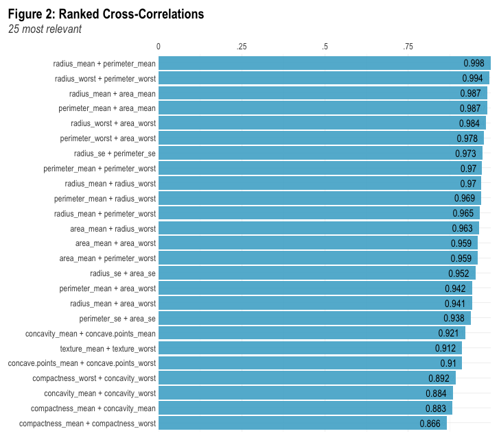

```{r setup, include=FALSE}
knitr::opts_chunk$set(echo = TRUE)

library(tidyverse)
library(lares) # for the correlation plot 
library(gtsummary)

## loading in the full dataset. 
bc <- read.csv("data/breast-cancer.csv") %>% as_tibble()

```


\vspace{75mm}

\begin{center}
{\bf Abstract}
\end{center}

|        we will write an abstract eventually.

\newpage
# 1. Introduction

## 1.1. Overview


## 1.2. Objectives
The major objective of this project is to used the dataset provided to fit two different models both with the goes of modeling patient diagnosis. The first model will be a full Newton-Raphson algorithm (full model). The second will be a logistic-LASSO model (optimal model) to select features in our dataset. This will be implemented using path-wise coordinate-wise optimization algorithm to and 5-fold cross validation obtain the optimal solution. The algorithms for both these methods will be discussed in our methods section and corresponding code will be found in the appendix. 


# 2. Methods


## 2.1. Data Cleaning and Exploratory Analysis

The data set of interest contains 569 rows and 33 columns all related to breast tissue images. Each entry of the table represent an individual patient.  Of primary interest is the column containing information about patient diagnosis of cancer taking on values either malignant or benign.  One column contains information about patient ID which will be removed from our dataset. The other 30 columns correspond to numerical information about the breast imaging. The variables containing information such as radius, texture, perimeter, area, smoothness, compactness, concavity, concave points, symmetry, and fractal dimension. These variable are going to be used to help model the diagnosis.

```{r message=FALSE, warning=FALSE, include=FALSE}
bc_corr <- bc %>% 
  mutate(y = ifelse(diagnosis == "M", 1, 0)) %>% 
  relocate(y)  %>% 
  select(-c(id, y, diagnosis))

cor_cov_all <- cor(bc_corr)

bad <- c(
  "area_mean", "area_worst", "perimeter_mean", "perimeter_worst", "radius_mean"
  , "perimeter_se", "area_se"
  , "concave points_worst", "concavity_mean"
  , "texture_worst"
)
```

In a quick exploration of the data it has been found that there is a high correlation between many of the variables. This is seen in **Figure 1**. The heat map correlation plot there are a lot of varaible with dark blue coloring representing a high correlation. High correlations can cause major issues with the methods we are going to use so understanding why there is high correlation in our data is important. 

To explore the correlation more **Figure 2** shows the highest 25 correlation in our data.  We see that the highest correlation is between radius mean and perimeter mean with a correlation values of 0.998. In the graph there are 21 combinations of variables that achieve a correlation over 0.90. This is cause for major concern. We can break these 21 pairings into equivalance classes for further inspection. The first grouping that are all mutually correlated are  {`area_mean`, `area_worst`, `perimeter_mean`, `perimeter_worst`, `radius_mean`, `radius_worst`}. This grouping represents the 15 correlation pairs in **Figure 2**.  Mathematically, if we consider the equivalence classes of variables that are highly correlated, these six variables would belong to the same equivalence class. To identify the best proxy for this grouping we look at the highest mean correlation which turns out to be `radius_worst`. The next grouping of correlated variables is {`radius_sd`, `perimeter_se`, `area_se`}. The best representative will be `radius_se`. Next we can group  {`concavity_mean`,`concavity_worst`, `concave.point_worst`, `concave.point_mean`} together, and we find that the best variable  proxy is `concave.point_worst`.  Finally, {`texture_mean`, `texture_worst`} is our last grouping with `texture_mean` being the variable saved. Thus from all the grouping and saving only the best proxy we will be removing `r length(bad)` variables leaving `r 30 - length(bad)` variables in our dataset.  

All the variables used can be seen in Table 1. In Table 1 we see that there are 357 benign (B) cases and 212 malignant (M) cases. This dataset does not contain any missing values. To implement both the full and optimal model the data set will be split into train and test sets using an 80-20 split. 

```{r echo=FALSE, message=FALSE, warning=FALSE, fig.width = 8, fig.asp=0.8}
title = "Figure 1: Correlation Heat Plot of all Covariates"
corrplot::corrplot(cor_cov_all, 
                   method = "color",
                   type = "lower", 
                   insig = "blank",
                   diag = FALSE,
                   title=title,
                   mar=c(0,0,1,0)) 
```


```{r eval=FALSE, message=FALSE, warning=FALSE, include=FALSE}
# this doesn't work in pdf files so it is not being run 
corr_cross(bc_corr, # name of dataset
  top = 25 # display top 10 couples of variables (by correlation coefficient)
)  +
  geom_text(aes(label =  round(corr,3)), hjust = 1.3) +
  labs(title= "Figure 2: Ranked Cross-Correlations")
```



Table 1: Patient Characteristics
```{r echo=FALSE, message=FALSE, warning=FALSE}
bc <- 
  read_csv("./data/breast-cancer.csv") %>% 
  #mutate(diagnosis = 1 * (diagnosis == "M")) %>% 
  select(-id)

remove_bad_vars <- function(indat, bad_vars){
  outdat <-
    indat %>% 
    dplyr::select(-bad_vars)
    return(outdat)
}
bc <- remove_bad_vars(bc, bad)

tbl_summary(bc, by = diagnosis,
            statistic = list(all_continuous() ~ "{mean} ({sd})",
                     all_categorical() ~ "{n} / {N} ({p}%)"),
    digits = all_continuous() ~ 2) %>% 
  add_p()  %>% 
  modify_header(label ~ "**Variable**") %>%
  modify_spanning_header(c("stat_1", "stat_2") ~ "**Diagnosis Received**")# %>%
  #bold_labels() 
  #modify_caption("**Patient Characteristics** (N = {N})")

```


## 2.2 Newton-Raphson Algorithm 

To implement the Newton-Raphson Algorithm we need to first examine the likelihood, and derive the gradient and Hessian matrix. 

First we will look at the likelihood function for our data which has a single binary response and `r 30-length(bad)` numerical explanatory variables. First we know that
\[
\pi_i = P(Y_i=1|x_{i,1}, \dots x_{i,20}) = \frac{e^{\beta_0+\beta_1x_{i,1}+ \dots \beta_{20}x_{i,20}}}{1 + e^{\beta_0+\beta_1x_{i,1}+ \dots \beta_{20}x_{i,20}}} = \frac{e^{\beta_0+\sum^{20}_{j=1}\beta_jx_{i,j}}}{1 + e^{\beta_0+\sum^{20}_{j=1}\beta_jx_{i,j}}}
\]

where $\mathbf{X_i}$ represents the $i$ observation of all 20 of our predictor variables. 
For the data likelihood funciton is is given by 
\[ L(\mathbf{X}| \mathbf{\beta}) = \prod^n_{i=1} \left[ \pi_i^{y_i}(1-\pi_i)^{1-y_i} \right]
\]
where $y_i$ represents out binary outcome for the $i$ individual. 
Finding the log-likelihood we have 
\[ l(\mathbf{X}| \vec{\beta}) =\sum^n_{i=1} \left[ y_i\left(\beta_0 + \sum^{20}_{j=1}\beta_jx_{i,j}  \right) - \log\left( 1 + \exp\left(\beta_0 + \sum^{20}_{j=1} \beta_jx_{i,j} \right) \right) \right]
\]

The gradient is the partial derivative of the log-likelihood with respect to each $\beta_j$ variable. Observe 

\[ \nabla l(\mathbf{X}|\vec{\beta}) = \left[ \sum^n_{i=1} \begin{matrix} y_i-\pi_i & \sum^n_{i=1} x_{i,1}(y_i-\pi_i) & \dots & \sum^n_{i=1} x_{i,20} (y_i-\pi_i) \end{matrix}\right]^{T}_{(1 \times 21)} 
\]

Finally, using the gradient we can derive our hessian matrix. Note that due to the 20 predictor variables the hessian will be a 21 by 21 matrix. 

\begin{align*}
 \nabla^2 l(\mathbf{X}|\vec{\beta}) &= - \sum^n_{i=1} \begin{pmatrix} 1 \\ X \end{pmatrix} \begin{pmatrix} 1 & X \end{pmatrix} \pi_i (1-\pi_i) \\
 &= - \begin{pmatrix} 1 & X \end{pmatrix} diag( \pi_i (1-\pi_i)) \begin{pmatrix} 1 \\ X \end{pmatrix}
\end{align*}

Where $X = (x_{i,1}, \dots, x_{i, 20})$. Note that this matrix will always be negative definite at all parameters making the this a well behaved problem. Using the likelihood, gradient and hessian the Newton-Raphson algorithm was implement in R and can be seen in **Appendix #**. There are two modification that have been made to the algorithm. The first is to control assent direction by checking the eigen values are negative representing a negative definite matrix. The second modification is to include half stepping to increase the speed of the algorithm. Note that major problems arise when highly correlated variables are included in the model. Without excluding the `r length(10)` variables the Newton-Raphson method would not converge due to multicollinearity issues. 


## 2.3 Logistic LASSO Algorithm 

__Lemma 1.__ Consider the optimization problem
  \[ \min_{x \in \mathbb{R}}  \left\{ \frac{1}{2}(x - b)^2 + c|x| \right\} \]
for $b \in\mathbb{R}$ and $c \in \mathbb{R}_{++}$. It follows that the minimizer is given by
  \[ \hat{x} = S(b, c), \]
where $S$ is the soft-thresholding operator.

__Lemma 2.__ Consider the optimization problem
  \[ \min_{\beta_k \in \mathbb{R}} \left\{ \frac{1}{2n} \sum_{i = 1}^n w_i \left(z_i - \sum_{j = 1}^p \beta_j x_{ij} \right)^2 \right\} \]
for some $k \in \{ 1, \ldots, p \}$. It follows that the minimizer is given by
  \[ \hat{\beta}_k = \left( \sum_{i = 1}^n w_i x_{ik}^2 \right)^{-1} \sum_{i = 1}^n w_i x_{ik} \left(z_i - \sum_{j \neq k} \beta_j x_{ij} \right). \]

__Lemma 3.__ With $\hat{\beta}_k$ defined as above,
\begin{align*}
\min_{\beta_k \in \mathbb{R}}& \left\{ \frac{1}{2n} \sum_{i = 1}^n w_i \left(z_i - \sum_{j = 1}^p \beta_j x_{ij} \right)^2 + \lambda \sum_{j = 1}^p |\beta_j| \right\} \\
  &= \min_{\beta_k \in \mathbb{R}} \left\{ \frac{1}{2}(\beta_k - \hat{\beta}_k)^2 + \left( \frac{1}{n} \sum_{i = 1}^n w_i x_{ik}^2 \right)^{-1} \lambda |\beta_k| \right\}.
\end{align*}

__Proposition.__ By Lemma 1 and Lemma 3,
\begin{align*}
 \underset{\beta_k \in \mathbb{R}}{\arg \min} & \left\{ \frac{1}{2n} \sum_{i = 1}^n w_i \left(z_i - \sum_{j = 1}^p \beta_j x_{ij} \right)^2 + \lambda \sum_{j = 1}^p |\beta_j| \right\} \\
  &= S \left(\hat{\beta}_k, \left( \frac{1}{n} \sum_{i = 1}^n w_i x_{ik}^2 \right)^{-1} \lambda \right) 
 \end{align*} 


## 2.4 5-fold Cross Validation 

To properly implement the logistic LASSO model an optimal $\lambda$ must be selected. First, we need to define our range of possible $\lambda$ values. To start we define the biggest value as $\lambda_{max}$. This is defined as the smallest penalty for which $\beta_k=0$ for all $k\in\{1, \dots, p\}$. The smallest value in our range is $\lambda_{min} = \lambda_{max}/1000$. This formula was recommended in a paper **Find paper**, however, we found it does not achieve our derived minimum property. Therefore we imperially found $\lambda_{min}$ by starting with the suggested formula and then selecting a value a quite a bit smaller (a fourth of the size). Thus, our range of values we are going to try for $\lambda$ is $(\lambda_{max}, \lambda_{min})$ with step sizes between values on a log scale result is 100 values.  This process will decrement through the $\lambda$ values. 

Our goal is to select an optimal $\lambda$ value. To select the best value we will implement a 5-fold Cross Validation system. In **Figure 3** the first step of the process is to split the data into train and test data as described above. Using just the training data the cross validation procedure will implement a 5 fold process. In each fold the data will be split into 5 chunks. During the first fold the first split of data will be used as a test set while the 4 other splits will be used as the training data. The second fold will use the second split as the test and the rest as train set. This process will continue for each fold.  Each fold will produce an AUC value for each $\lambda$ in our range values. For example, in on Fold we have 100 $\lambda$ values all with one corresponding AUC value. Thus, for 5 folds each $\lambda$ will have 5 AUC values. 

To select our optimal we will use two processes greatest mean AUC or Minimax AUC 

The greatest mean AUC takes the average AUC value for each 100 $\lambda$ in our range. Then is selects the largest AUC value as the optimal model. 

The Minimax AUC selects the worst AUC value for each 100 $\lambda$ in our range. Then the maximum worst AUC is selected as our optional model. 

The greatest mean AUC and Minimax AUC optimal models will be compared against the full model. 

{width=105%}


# 3.0 Results 

## 3.1 Cross-Validation Results

## 3.2 Coefficient Model Comparison 

## 3.3 Model Validation Results 


# 4.0 Dissucsion 

## 4.1. Summary of Findings

## 4.2. Limitations

## 4.3. Next Steps and Future Research

## 4.4. Group Contributions


\newpage

# References 


\newpage 

# Appendix


