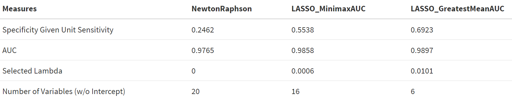

```{r setup, include=FALSE}
knitr::opts_chunk$set(echo = TRUE)

source("shared_code/setup.R")
load("plotting_data.RData")


library(tidyverse)
library(lares) # for the correlation plot 
library(gtsummary)

## loading in the full dataset. 
bc <- read.csv("data/breast-cancer.csv") %>% 
  as_tibble() %>% 
  select(-id) %>% 
  janitor::clean_names()

```


\vspace{75mm}

\begin{center}
{\bf Abstract}
\end{center}

|        we will write an abstract eventually.

\newpage
# 1. Introduction

## 1.1. Overview

As breast cancer is one of the most common kinds of cancer in the United States, great efforts have been made to aid in early and accurate detection. Improvements in tumor imaging technology used in screening procedures have allowed us access to more data than ever before, ideally to construct better ways to evaluate disease severity. However, data does not always equate to information [1]. With more data comes more noise, and it becomes more important for statisticians and medical practitioners to separate signal from that noise.

## 1.2. Objectives

In this paper we investigate two questions: does having more data always correspond to an advantage in diagnosis prediction? Can we reduce the amount of data we need to collect while maintaining (or increasing) predictive power?

To this end, we use a breast cancer imaging dataset (detailed below) to fit two different models with the goal of predicting patient diagnosis outcomes. The first is a generalized linear-logistic regression model with a full set of predictors (i.e., "full model"), calculated using a Newton-Raphson optimization algorithm. The second is a penalized logistic-LASSO model (i.e., "optimal model"), which is capable of reducing the number of selected predictors from our dataset. This is implemented using a path-wise coordinate-descent optimization algorithm, and we utilize 5-fold cross validation to obtain the optimal $\lambda$ penalization term. The algorithms for each method are discussed below in the methods section and corresponding code can be found in the appendix.

# 2. Methods

## 2.1. Data Cleaning and Exploratory Analysis

The data set of interest contains 569 rows and 32 columns related to breast tissue imaging with each entry representing an individual patient. The outcome of interest is patient diagnosis, taking on values of either malignant or benign. One column contains information about patient ID, which will be removed from our dataset. The other 30 columns correspond to summary measures (mean, standard deviation, and maximum) of variables such as radius, texture, perimeter, area, smoothness, compactness, concavity, concave points, symmetry, and fractal dimension. This dataset does not contain any missing values.

```{r predictor correlation plot, message=FALSE, warning=FALSE, include=FALSE}
bc_corr <- bc %>% 
  mutate(y = ifelse(diagnosis == "M", 1, 0)) %>% 
  relocate(y)  %>% 
  select(-c(y, diagnosis))

cor_cov_all <- cor(bc_corr)

bad <- c(
  "area_mean", "area_worst", "perimeter_mean", "perimeter_worst", "radius_mean"
  , "perimeter_se", "area_se"
  , "concave_points_worst", "concavity_mean"
  , "texture_worst"
)
```

In a quick exploration of the data, we find many of the predictors are highly correlated with one another. In **Figure 1**, we see a heat map correlation plot where several variables have dark blue coloring representing strong relationships. High collinearity between predictors can cause major issues in regression methods, particularly with high-dimensional data. To explore the correlation further, **Figure 2** shows the 25 largest correlations in our data. We see that the highest correlation is between radius mean and perimeter mean with a correlation value of 0.998 (maximum of 1). In the graph there are 21 combinations of variables that achieve a correlation greater than 0.90, which is a cause for concern in this context. We can break these 21 pairings into equivalence classes for further inspection.

The first grouping that are all mutually correlated is {`area_mean`, `area_worst`, `perimeter_mean`, `perimeter_worst`, `radius_mean`, `radius_worst`}. This grouping represents 15 of the correlation pairs in **Figure 2**.  Mathematically, if we consider the equivalence classes of variables that are highly correlated, these six variables would belong to the same equivalence class. To identify the best proxy for this grouping we look at the highest mean correlation which turns out to be `radius_worst`. The next grouping of correlated variables is {`radius_se`, `perimeter_se`, `area_se`}. The best representative will be `radius_se`. Next we can group {`concavity_mean`, `concave_points_worst`, `concave_points_mean`} together, and we find the best proxy variable is `concave_points_mean`. Finally, {`texture_mean`, `texture_worst`} is our last grouping with `texture_mean` being the variable saved. Thus from all the grouping and saving only the best proxy we will be removing `r length(bad)` variables leaving `r 30 - length(bad)` in our dataset. All the predictors used can be seen in Table 1.

In Table 1 we see that there are 357 benign (B) cases and 212 malignant (M) cases. To implement both the full and optimal model the data set will be split into train and test sets using an 80-20 split. The data is standardized before fitting both of our models to help with comparability. For LASSO regression in particular, it is best practice to center and scale data. The $\ell_1$-norm penalization in LASSO regression will unequally penalize coefficient estimates if the covariates are of different magnitudes or scales. Therefore, standardizing our data ensures equal weighting and penalization.

```{r echo=FALSE, message=FALSE, warning=FALSE, fig.width = 8, fig.asp=0.8}
title = "Figure 1: Correlation Heat Plot of all Covariates"
corrplot::corrplot(cor_cov_all, 
                   method = "color",
                   type = "lower", 
                   insig = "blank",
                   diag = FALSE,
                   title=title,
                   mar=c(0,0,1,0)) 
```

```{r eval=FALSE, message=FALSE, warning=FALSE, include=FALSE}
# this doesn't work in pdf files so it is not being run 
corr_cross(bc_corr, # name of dataset
  top = 25 # display top 10 couples of variables (by correlation coefficient)
)  +
  geom_text(aes(label =  round(corr,3)), hjust = 1.3) +
  labs(title= "Figure 2: Ranked Cross-Correlations")
```

{width=80%}

Table 1: Patient Characteristics
```{r echo=FALSE, message=FALSE, warning=FALSE}
remove_bad_vars <- function(indat, bad_vars){
  outdat <-
    indat %>% 
    dplyr::select(-bad_vars)
    return(outdat)
}
bc <- remove_bad_vars(bc, bad)

tbl_summary(bc, by = diagnosis,
            statistic = list(all_continuous() ~ "{mean} ({sd})",
                     all_categorical() ~ "{n} / {N} ({p}%)"),
    digits = all_continuous() ~ 2) %>% 
  add_p()  %>% 
  modify_header(label ~ "**Variable**") %>%
  modify_spanning_header(c("stat_1", "stat_2") ~ "**Diagnosis Received**")# %>%
  #bold_labels() 
  #modify_caption("**Patient Characteristics** (N = {N})")

```


## 2.2 Newton-Raphson Algorithm 

To implement the Newton-Raphson Algorithm we need to first examine the likelihood function and derive the gradient and Hessian matrix. First, we will look at the likelihood function for our data, which has a single binary response and $p$ numerical explanatory variables. We know that
\[
\pi_i = P(Y_i=1|x_{i,1}, \dots x_{i,p}) = \frac{e^{\beta_0+\beta_1x_{i,1}+ \dots \beta_{p}x_{i,p}}}{1 + e^{\beta_0+\beta_1x_{i,1}+ \dots \beta_{p}x_{i,p}}} = \frac{e^{\beta_0+\sum^{p}_{j=1}\beta_jx_{i,j}}}{1 + e^{\beta_0+\sum^{p}_{j=1}\beta_jx_{i,j}}}
\]
where $\mathbf{X_i}$ represents the $i$-th observation of all p of our predictor variables. 
For our data, the likelihood function is given by 
\[ L(\mathbf{X}| \mathbf{\beta}) = \prod^n_{i=1} \left[ \pi_i^{y_i}(1-\pi_i)^{1-y_i} \right]
\]
where $y_i$ represents out binary outcome for the $i$-th individual. Finding the log-likelihood we have 
\[ l(\mathbf{X}| \vec{\beta}) =\sum^n_{i=1} \left[ y_i\left(\beta_0 + \sum^{p}_{j=1}\beta_jx_{i,j}  \right) - \log\left( 1 + \exp\left(\beta_0 + \sum^{p}_{j=1} \beta_jx_{i,j} \right) \right) \right].
\]
The gradient is the partial derivative of the log-likelihood with respect to each $\beta_j$ variable. Observe 
\[ \nabla l(\mathbf{X}|\vec{\beta}) = \left[ \sum^n_{i=1} \begin{matrix} y_i-\pi_i & \sum^n_{i=1} x_{i,1}(y_i-\pi_i) & \dots & \sum^n_{i=1} x_{i,20} (y_i-\pi_i) \end{matrix}\right]^{T}_{(1 \times (p+1))} .
\]
Finally, using the gradient we can derive our hessian matrix. Note that due to the 20 predictor variables the hessian will be a $p+1$ by $p+1$ matrix. 
\begin{align*}
 \nabla^2 l(\mathbf{X}|\vec{\beta}) &= - \sum^n_{i=1} \begin{pmatrix} 1 \\ X \end{pmatrix} \begin{pmatrix} 1 & X \end{pmatrix} \pi_i (1-\pi_i) \\
 &= - \begin{pmatrix} 1 & X \end{pmatrix} diag( \pi_i (1-\pi_i)) \begin{pmatrix} 1 \\ X \end{pmatrix}
\end{align*}
Where $X = (x_{i,1}, \dots, x_{i, p})$. Note that this matrix will always be negative definite at all parameters making this a well-behaved problem. Plus, the logistic regression objective function is globally concave and hence there exists one global optimum. Using the likelihood, gradient, and hessian, the Newton-Raphson algorithm implemented in R can be seen in **Appendix #**. Two modifications have been made to the algorithm. The first is to control ascent direction by checking that the eigenvalues are negative, representing a negative definite matrix. The second modification is to include half-stepping to increase the speed of the algorithm.

Note that major problems arise when highly correlated variables are included in the model. To be specific, as the Newton-Raphson algorithm proceeds, the absolute values of $\beta_i$ continue to increase. This causes some of the elements in the probability vector to be very close to 1, leading some of the elements in log(1-p) vector to be negative infinity and hence the next log likelihood to diverge to negative infinity. As a result, the Newton-Raphson algorithm fails to reach the convergence of maximum likelihood estimation. Without excluding the 10 variables the Newton-Raphson method would not converge due to multicollinearity issues. 


## 2.3 Logistic LASSO Algorithm 

__Lemma 1.__ Consider the optimization problem
  \[ \min_{x \in \mathbb{R}}  \left\{ \frac{1}{2}(x - b)^2 + c|x| \right\} \]
for $b \in\mathbb{R}$ and $c \in \mathbb{R}_{++}$. It follows that the minimizer is given by
  \[ \hat{x} = S(b, c), \]
where $S$ is the soft-thresholding operator.

__Lemma 2.__ Consider the optimization problem
  \[ \min_{\beta_k \in \mathbb{R}} \left\{ \frac{1}{2n} \sum_{i = 1}^n w_i \left(z_i - \sum_{j = 1}^p \beta_j x_{ij} \right)^2 \right\} \]
for some $k \in \{ 1, \ldots, p \}$. It follows that the minimizer is given by
  \[ \hat{\beta}_k = \left( \sum_{i = 1}^n w_i x_{ik}^2 \right)^{-1} \sum_{i = 1}^n w_i x_{ik} \left(z_i - \sum_{j \neq k} \beta_j x_{ij} \right). \]

__Lemma 3.__ With $\hat{\beta}_k$ defined as above,
\begin{align*}
\min_{\beta_k \in \mathbb{R}}& \left\{ \frac{1}{2n} \sum_{i = 1}^n w_i \left(z_i - \sum_{j = 1}^p \beta_j x_{ij} \right)^2 + \lambda \sum_{j = 1}^p |\beta_j| \right\} \\
  &= \min_{\beta_k \in \mathbb{R}} \left\{ \frac{1}{2}(\beta_k - \hat{\beta}_k)^2 + \left( \frac{1}{n} \sum_{i = 1}^n w_i x_{ik}^2 \right)^{-1} \lambda |\beta_k| \right\}.
\end{align*}

__Proposition.__ By Lemma 1 and Lemma 3,
\begin{align*}
 \underset{\beta_k \in \mathbb{R}}{\arg \min} & \left\{ \frac{1}{2n} \sum_{i = 1}^n w_i \left(z_i - \sum_{j = 1}^p \beta_j x_{ij} \right)^2 + \lambda \sum_{j = 1}^p |\beta_j| \right\} \\
  &= S \left(\hat{\beta}_k, \left( \frac{1}{n} \sum_{i = 1}^n w_i x_{ik}^2 \right)^{-1} \lambda \right) 
 \end{align*} 
 
 **More info from the pres: NEed to be editted to paragraph form**
 
 
For vector $\boldsymbol\alpha \in \mathbb{R}^{p + 1}$, define $g : \mathbb{R}^{p+1} \to \mathbb{R}$ to be
  \[ g(\boldsymbol\beta) \equiv - \frac{1}{2n} \sum_{i = 1}^n w_i (z_i - \mathbf{X}_i^t \boldsymbol\beta )^2 + O(\boldsymbol\alpha), \]
the Taylor expansion of our log-likelihood centered around $\boldsymbol\alpha$, where
  \begin{align*}
    z_i &\equiv \mathbf{X}_i^t \boldsymbol\alpha + \frac{y_i - \pi_i}{w_i}, \tag{effective response} \\
    w_i &\equiv \pi_i (1 - \pi_i), \text{ and} \tag{effective weights} \\
    \pi_i &\equiv \frac{e^{\mathbf{X}_i^t \boldsymbol\alpha}}{1 + e^{\mathbf{X}_i^t \boldsymbol\alpha}}
  \end{align*}
for $i \in \{1, \ldots, n \}.$


It follows that for any $\lambda \in \mathbb{R}_+$,
  \[
    \underset{\beta_k \in \mathbb{R}}{\arg \min} \left\{ g(\boldsymbol\beta) + \lambda \sum_{j = 1}^p |\beta_j| \right\}
    = S \left(\hat{\beta}_k, \lambda_k \right), \text{ where}
  \]
  \begin{align*}
    \hat{\beta}_k &\equiv \left( \sum_{i = 1}^n w_i x_{ik}^2 \right)^{-1} \sum_{i = 1}^n w_i x_{ik} \left(z_i - \sum_{j \neq k} \beta_j x_{ij} \right), \\
    \lambda_k &\equiv \left( \frac{1}{n} \sum_{i = 1}^n w_i x_{ik}^2 \right)^{-1} \lambda,
  \end{align*}
and $S$ is the soft-thresholding (or _shrinkage_) function. This is analogous to a penalized, weighted Gaussian regression.


Our coordinate descent algorithm proceeds as follows.

- Outer Loop: Decrement over $\lambda \in (\lambda_{\max}, \ldots, \lambda_{\min})$ where $\lambda_{\max} = \frac{max|X^Ty|}{n}$
- Middle Loop: Update $\boldsymbol\alpha = \boldsymbol\beta$ and Taylor expand $g$ around $\boldsymbol\alpha$.
- Inner Loop: Update $\beta_k = S \left(\hat{\beta}_k, \lambda_k \right)$ sequentially for $k \in \{ 0, 1, \ldots, p, 0, 1, \ldots, p, 0, 1, \ldots \}$ until convergence.

To be specific, an outer loop is created for every new value of $\lambda$ and then we use coordinate descent to solve the penalized weighted least-squares problem. Namely, $z_i$, $w_i$, and $\pi_i$ are updated at the current parameters for every outer loop to update the quadratic approximation $g(\beta)$ and then keep updating parameters until it satisfies the threshold set beforehand.

Note: the middle loop terminates when a given Taylor expansion no longer yields updates (within the specified tolerance) to $\boldsymbol\beta$ in the inner loop.


## 2.4 Five-fold Cross Validation 

As the performance of the logistic LASSO model depends on the penalty factor ($\lambda$) that is selected, we will perform cross validation in order to determine the $\lambda$ that produces a model that maximizes outcome prediction accuracy. 

First, we need to define our range of possible $\lambda$ values, where the largest value produces a model with no predictors selected and the smallest value would produce a model with all predictors selected. While we could make $\lambda_{max}$ infinitely large, we will define the maximum value as as the smallest penalty for which $\beta_k=0$ for all $k\in\{1, \dots, p\}$. This value works out to be the maximum of the inner product between our predictors ($X$) and our outcome ($Y$) from the imaging dataset. Likewise, while we could make $\lambda_{min}$ infinitely small (but greater than 0), we will select the largest value that produces the full model, which is identical to the model produced by the Newton Raphson algorithm we have previously defined. As recommended by Friedman et. al [2], we started by setting the smallest value in our range to be $\lambda_{min} = \frac{\lambda_{max}}{1000}$. However, we were not able to use this value as as the minimum $\lambda$ in our range because it did not select the full model. Thus, we used the suggested $\frac{\lambda_{max}}{1000}$ as a starting point and empirically derived our $\lambda_{min}$ by halving the working value a few times -- ultimately, we saw that a value of $\frac{\lambda_{max}}{4000}$ would be a suffice as a sufficiently small penalty factor that would select the full model. We then constructed a uniform sequence between $\log{\lambda_{max}}$ and $\log{\lambda_{min}}$ so that the sequence would contain 100 values and then exponentiated all values in the sequence. In this fashion, we thus created a range of 100 values between $\lambda_{max}$ and $\lambda_{min})$ a log scale. 

After defining this range of $\lambda$ values, we implemented a five-fold cross validation algorithm to identify the best $\lambda$. In **Figure 3** the first step of the process is to split the full dataset into train and test data as described above. The test data will not be touched until an optimal $\lambda$ is selected and final method comparison is performed. Using just the training data the cross validation procedure implements a five-fold process where the test data is split into five "folds" or chunks. During the first iteration, the first fold of data is used as a test or "validation" set while the four other splits are used as the training set. The second iteration will use the second fold as the validation set and the remaining folds as the training set. This process continues for each fold, producing an Area-Under-the- ROC-Curve (AUC) value for each $\lambda$ in our range of values. For example, in one fold we have 100 $\lambda$ values all with one corresponding AUC value. Thus, for five folds each $\lambda$ will have five associated AUC values. 

As we implemented the five-fold cross validation process, we grew concerned over the potential of our step size between $\lambda$ values being too large and that the changes between models selected by consecutive were too dramatic. To increase the precision of our estimate and to prevent the process from selecting more than one variable between penalty values, we modified the simple cross validation procedure to include a grid search around perceived maximums. 

To select our optimal tuning parameter, we use two measures: greatest mean AUC and Minimax AUC from 5-fold cross validation. The greatest mean AUC takes the average AUC value for each $\lambda$ in our range of 100 $\lambda$ values and selects the model with the largest AUC value as optimal. The Minimax AUC selects the minimum of the maximum $1-AUC$ values over all 100 $\lambda$ values to account for the scenario where we aim to minimize the possible loss for the worst case scenario. Then the model with minimum-worst AUC is selected as our optimal model. The greatest mean AUC and Minimax AUC optimal models are compared against the full model below.

**Figure 3: Cross Validation Procedure**

{width=105%}

## 2.5 Final Model Evaulation

Each optimal $\lambda$ selected is then used to fit a final model on the full training dataset. To compare these optimal models with the full (Newton-Raphson) model, we use the $\beta_j$ values specified by each to make classification predictions based on the test dataset, which is held out of analysis prior to this step. In other words, the $\beta_j$ values in each model are used in conjunction with the test data, $X_{ij}$, to predict class probabilities for each testing data observation. These predicted probabilities are compared with the observed outcomes in the testing data to produce receiver operating characteristic (ROC) curves, as well as AUC, sensitivity, and specificity values.

*This section might not be needed. I wanted to highlight Charly's question from the pres...*

# 3. Results 

## 3.1 Cross-Validation Results

Evaluating the cross validation results, we can first confirm that our range of $\lambda$ values has one maximum AUC value when using the greatest mean AUC optimal lambda method. This can be seen in **Figure 4** depicting the largest AUC and corresponding lambda values by the vertical dotted line. After the vertical dotted line the AUC values decrease thus indicating one maximum values exists in our range. 

We can also evaluate our cross validation results by looking at the beta estimates for each corresponding $\lambda$ value. This is seen in **Figure 5**. The smallest value of -log(lambda) corresponds with our null model where all estimates of $\beta_j$ are zero and the $\lambda$ penalization term is large. The largest value of -log(lambda) corresponds with a full model where no $\beta_j$ values are zero. The vertical lines depict the optimal lambda value chosen for each of our selection methods. We see that the greatest mean AUC selects a larger $\lambda$ value, greater penalization, and thus a model with fewer predictor coefficients compared to the minimax AUC method. 

**Figure 4: Cross Validation Results: Selecting Best Lambda**

```{r, warning=FALSE, message=FALSE, echo=FALSE}
auc_vs_lambda <- 
  cv_res[[1]][[1]] %>% 
  data.frame() %>% 
  ggplot(x = lambda, y = mean_auc) +
  geom_line(aes(x = lambda, y = mean_auc), col = "black") +
  geom_vline(xintercept = selected_lambda, linetype = "dashed", color = "red") +
  geom_point(aes(x = lambda, y = mean_auc), col = "black") +
  geom_text(aes(x = selected_lambda, y = 0.96, label = "Lambda - Greatest Mean AUC = 0.0101"), col = "red", size = 3, hjust = -0.05) +
#  coord_cartesian(xlim = c(0, 0.2), ylim = c(.9, 1)) +
  labs(title = "Mean AUC vs. Lambda",
       x = "Lambda",
       y = "Mean AUC")
auc_vs_lambda
```

**Figure 5: Cross Validation Results: LASSO Coefficients**

```{r, warning=FALSE, message=FALSE, echo=FALSE}
beta_coef_plot <- 
  lfr_df %>% 
  group_by(lambda) %>% 
  filter(beta_coef != "intercept") %>% 
  ggplot(x = -log(lambda), y = coef_est, group = beta_coef) +
  geom_path(aes(x = -log(lambda), y = coef_est, group = beta_coef, col = beta_coef)) +
  geom_vline(xintercept = -log(selected_lambda), col = "black", linetype = "dashed") + 
  geom_text(aes(x = -log(selected_lambda), y = 5, label = "Lambda - Greatest Mean AUC"), colour = "black", size = 3, hjust = 1.05) +
  geom_vline(xintercept = -log(selected_lambda_minmax), col = "black", linetype = "dashed") +
  geom_text(aes(x = -log(selected_lambda_minmax), y = 5, label = "Lambda - Minimax AUC"), colour = "black", size = 3, hjust = 1.05) +
  labs(title = "Beta Coefficients in LASSO Model", y = "Coefficient Estimate", x = "-log(lambda)") + theme(legend.position = "none")
beta_coef_plot
```


## 3.2 Model Validation Results 

To compare the beta estimates in our full model and two optimal models, we can look at **Table 2**. Please note that we standardized our data so care needs to be taken before interpreting these values in the context of the project. Also note that care needs to be taken when interpreting the beta values for the optimal model because of standardization and the lambda penalty term. In **Table 2** we see that the greatest mean AUC has the most beta values equal to zero. **Table 3** also confirms that greatest mean AUC produces a model with 6 nonzero beta values with lambda value 0.0101, not including the intercept term. Minimax optimization selects 16 nonzero beta values with lambda value 0.0006. While each model has test AUC values above 0.97, the model with the largest test AUC is the greatest mean optimal model. 

While the AUC value is a good indicator of overall classification performance, we are still confronted with the trade-off between sensitivity and specificity. Imagining is typically the first line of defense for diagnosing cancers, so optimizing sensitivity is usually of great interest. In **Table 3** we have displayed the largest specificity value achieved while realizing sensitivity to equal 1 (all positive individuals correctly identified as positive). Namely, we are looking for a model that sacrifices the least value of specificity while still achieving 1 sensitivity. We can see in **Table 3**, the greatest mean AUC lasso model has the highest specificity, 69.23%. Though minimax AUC Lasso model is the minimum of the worst AUC model, it still achieves much larger specificity than the full model, 55.38%. Namely, if we choose to a lasso model, it is still expected to manage to achieve 55.38% specificity while maintaining 1 sensitivity for the worst case scenario. It is to be observed that full model has the lowest sensitivity, 24.62%, and hence needs to sacrificice specificity more than 75% to achieve 1 sensitivity. This sensitivity and specificity trade-off can also be seen in our ROC curves displayed in **Figure 6**. 

**Table 2: Beta Coefficients Comparing Full and Optimal Models**

{width=85%} <!--{height=70%}-->

**Table 3: Model Summary Comparing Full and Optimal Models**

{width=85%}


**Figure 6: Comparing Full and Optimal Models Performance**

{width=75%}


# 4. Discussion 

## 4.1. Summary of Findings

Comparing the Newton-Raphson full model against two optimal models (greatest mean AUC, minimax AUC) the model that out-preformed the others is the greatest mean AUC optimal model. This greatest mean AUC optimal model had the fewest predictors, highest AUC value, and highest specificity when maximizing sensitivity. Of course the ideal performance is to accurately classify every patient, AUC = 1; although very close, our test performance does not reach AUC = 1. Therefore, we need to balance sensitivity and specificity, to determine the lesser of two errors: false positives vs false negatives, when setting decision boundaries.

It is clear from our results that having more data does not always correspond to an advantage in diagnosis prediction. We found better prediction with many fewer predictors, six, in our optimal model compared to a full 20 in the model incorporating the most data. Given these results, it may benefit clinicians and practitioners to focus on certain indicators or attributes of breast imaging data in an effort to separate signal from noise.

## 4.2. Limitations

While the initial reduction of variables to limit high correlations was beneficial, we may have not selected the best representative of the correlation group. We did not try different representatives of the equivalence classes and so this might be a limitation for further study. Besides AUC as a metric of model performance, the accuracy rate of prediction can be also utilized as a means of measuring model performance if the information of the cutoff probability for classification is given from medical professionals.

We also see AUC values very close to a perfect 1.0 in each of the models considered. This could be due to very clean and unambiguous data, which limits our knowledge of how these models might actually perform in a "real-world" setting. In the future, it would be beneficial to examine different data sets in order to better understand how these models perform on breast imaging data.

## 4.3 Future Work

Two avenues of future work were discussed above, including the consideration of different model evaluation criteria based on clinician recommendation and implementation on more ambiguous data sets. Another interesting improvement could be the implementation of Monte Carlo Cross Validation. In this project, we performed five-fold cross validation once, however this procedure can be repeated multiple times with varied folds of the training data to obtain more stable estimates of the optimal $\lambda$ value. Additionally, models may perform better on larger datasets. Here, we only had 569 observations, but more observations could help us learn more about the relationships between the imaging data and diagnosis outcome.

## 4.4. Group Contributions

Our group worked in conjunction on many aspects of the project. Amy, Waveley, and Hun worked on developing and implementing the Newton-Raphson optimization algorithm. Jimmy worked on developing and implementing the LASSO coordinate-descent algorithm. Tucker and Waveley worked on the cross validation procedure and plotting results from these output. All group members worked on the project presentation and report in varying capacities.

\newpage

# References 

\begin{enumerate}[label={[\arabic*]}]
  \item  Duncan, J. R. (2017, September 1). Information overload: When less is more in medical imaging. De Gruyter. https://www.degruyter.com/document/doi/10.1515/dx-2017-0008/html?lang=en 
  \item Friedman J, Hastie T, Tibshirani R. Regularization Paths for Generalized Linear Models via Coordinate Descent. J Stat Softw. 2010;33(1):1-22. PMID: 20808728; PMCID: PMC2929880.
\end{enumerate}


\newpage 

# Appendix


